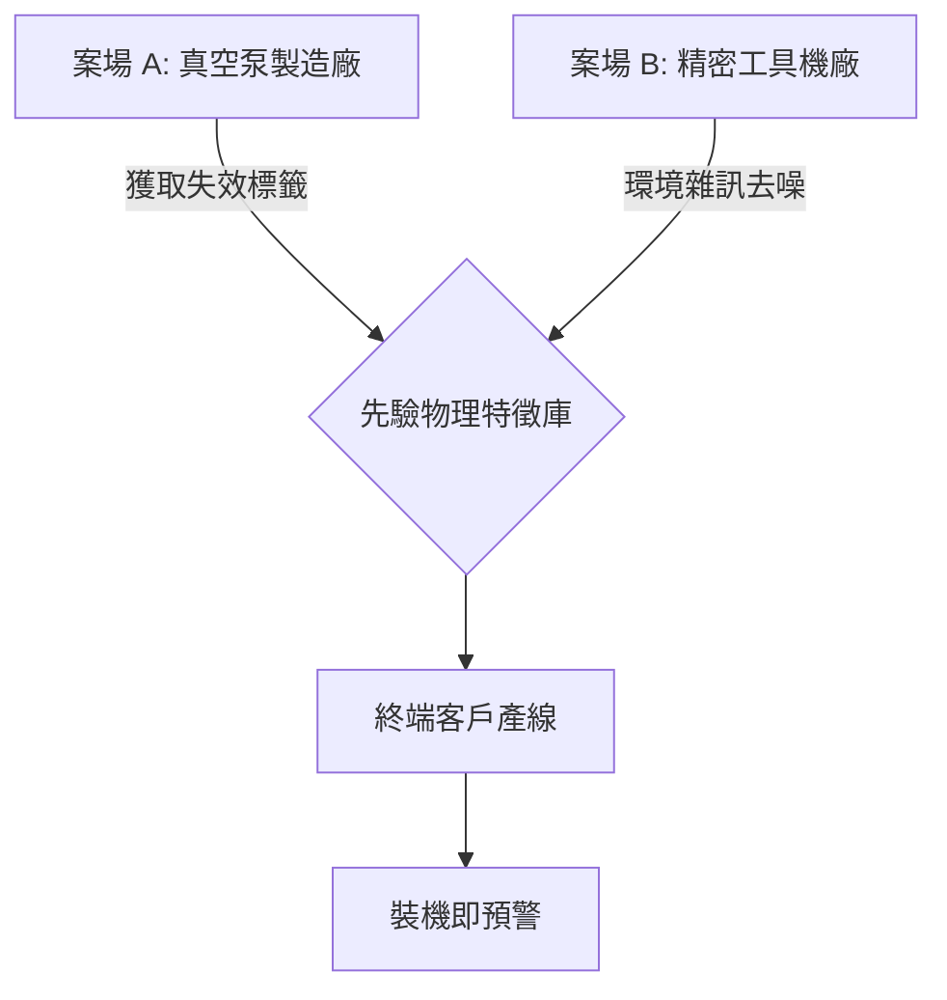

# 智慧製造真空設備 PHM 預測性維護方案
> [cite_start]**主題**：基於物理特徵與雙案場實證之邊緣 AI 診斷系統 [cite: 1]

---

## 1. 市場痛點
* **非預期停機損失**：一旦設備發生無預警故障，每小時損失高達數十萬至數百萬元 。
* **預防性維護浪費**：現行定期大修（PM）模式，導致許多運轉良好的設備被提早拆解 。
* **診斷透明度不足**：現有方案多僅停留在數據可視化，而非能告知故障點的診斷自動化 。
* **系統孤島與高昂成本**：大廠 PHM 方案多限於自家品牌且與維護合約高度綑綁，缺乏整合彈性 。
* **數據隱私與資安隔閡**：半導體廠內部數據極為敏感，傳統雲端 AI 方案與廠方資安政策存在衝突 。

## 2. 核心技術規格
[cite_start]本系統具備高採樣率與內建濾波技術，確保捕捉早期失效信號 [cite: 17]。

| 項目 | 規格參數 | 備註 |
| :--- | :--- | :--- |
| 取樣頻寬 | 6,000 Hz | [cite_start]精準捕捉軸承早期高頻微小失效信號 [cite: 17, 41] |
| 導入週期 | 8 週極速導入 | [cite_start]安裝首日即啟動監控，8 週內完成診斷模型微調 [cite: 49, 50, 69] |
| 硬體防護 | IP65 等級 | [cite_start]確保在切削液與高溫粉塵環境下的長期穩定性 [cite: 64] |

## 3. 系統診斷邏輯
### 3.1 技術特點
* **超寬頻感測技術**：使用具備極高頻寬與平坦頻率響應的專用震動感測器，專為 CbM 設計 。
* **高速序列通訊**：建立 2,000,000 bps 的超高鮑率 UART 通訊協議 。
* **進階數位訊號處理 (DSP)**：
    * **包絡分析 (Envelope Analysis)**：解調出淹沒在低頻噪音中的高頻微弱撞擊聲。
    * **快速傅立葉轉換 (FFT)**：將時域波形轉換成頻域（Hz）進行特徵分析 。
* **即時異常檢測**：萃取出最乾淨的「各倍頻振幅 (gE)」與「RMS 總值」 。

### 3.2 邊緣運算程式碼範例 (Python)
以下為模擬從 UART 讀取振動數據並執行 FFT 特徵提取的邏輯：

```python
import serial
import numpy as np

# 配置高速 UART 通訊 (2,000,000 bps)
def read_vibration_data(port='/dev/ttyAMA0'):
    ser = serial.Serial(port, 2000000, timeout=1)
    # 讀取 1024 bytes 原始振動數據
    raw_data = ser.read(1024) 
    data = np.frombuffer(raw_data, dtype=np.int16)
    return data

# 執行 FFT 轉換與特徵提取
def extract_features(signal, fs=6000):
    # 計算 RMS 總值與執行快速傅立葉轉換
    rms = np.sqrt(np.mean(signal**2))
    fft_result = np.abs(np.fft.fft(signal))
    return {"RMS": rms, "FFT_Peak": np.max(fft_result)}
```
## 4. 雙案場數據鏈架構 (Mermaid)


## 5. 開發進度與商業路徑
本計畫採取「階梯式滲透」戰略，利用雙案場建立的物理特徵護城河，達成比國際大廠更快的投資報酬回收 (ROI)。

### 5.1 階段性里程碑
我們將開發流程分為四個關鍵階段，確保在進入高階半導體市場前已具備極強的環境適應力：

- [x] **階段 A：雙案場技術硬化 (M1 - M4)** 深入真空泵製造廠（OEM）獲取極限失效數據，並在精密工具機廠的強雜訊環境中優化濾波演算法。
- [x] **階段 B：產品優化與小規模確認 (M5 - M8)** 感測器機構件升級至 **IP65 防護等級**，並開發「物理失效特徵自動識別庫」，降低對人工分析的依賴。
- [ ] **階段 C：客戶端動態生產確認 (M9 - M10)** 正式移師至終端客戶（如半導體封裝廠）產線，驗證模型在動態負荷下的穩定性，實現「8 週極速導入」的商業承諾。
- [ ] **階段 D：規模化擴散與高階滲透 (M11+)** 憑藉「免上雲、免長學習期」的資安與效率優勢，從中部傳產集群橫向複製，最終滲透半導體大廠市場。

### 5.2 營運時間規劃表 (Timeline)
| 期間 | 發展階段 | 技術與商業里程碑 |
| :--- | :--- | :--- |
| **M1 - M4** | 雙案場硬化 | 完成 OEM 與 Tooling 數據對齊，建立首批特徵標籤庫。 |
| **M5 - M8** | 產品優化 | 硬體加固至 IP65，算法自動化以降低維護成本。 |
| **M9 - M10** | 動態驗證 | 於變動工況下達成 8 週內完成 AI 診斷模型微調。 |
| **M11 - M12** | 標準化準備 | 建立標準化布署 SOP，並取得 2-3 家標竿客戶採購意向書。 |

---
